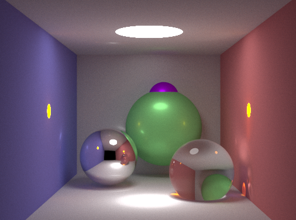

# README

Implementation of a simple renderer based on ray tracing.



There are several settings that can be changed :

```c++
// line 177 - 178, int main()
int edgeSample = ...; // MSAA samples in perEdge
int rayAmount = ...; // Ray shot in one subpixel
int width = ...; // width of picture
int height = ...; // height of picture; If you want to get result quickly, we recommend 102 * 76。

// line 20 - 22, Vector3 Shade(Scene& scene, const Ray& ray, int depth)
const double stopPossiblity = ...; // R.R. possiblity of stop.
const int minDepth = ...; // light bounces at least for $minDepth$ times. Before this, R.R. will not trigger.
// If you want to limit the max bouncing times, you can simply add a constant $maxDepth$ and add some code.
const int minRefDepth = ...; // For refractive object, path tracing will only choose one way; but ideally there should be at least 2 ways. Thus to make it realistic, we guarantee $minRefDepth$ times 2-way bouncing.
```

> In the result picture, we set them as this : 
>
> ```c++
> int edgeSample = 4;
> int rayAmount = 1000;
> int width = 512;
> int height = 380; 
> 
> const double stopPossiblity = 0.9;
> const int minDepth = 5; 
> const int minRefDepth = 2;
> ```
>
> It needs about 1 hour to complete on `Intel Core i7`. 

This project needs to set `C++20` and `OpenMP` to compile and run (please use optimization and in `g++` `-O3` is recommended, in `VS2019/MSVC`, `Release` mode is recommended). For `C++20`, we only use `pi` in `<numbers>` and `format` in `<format>`, which can be changed easily if you cannot use`C++20` now. However, at least `C++17` should be supported.